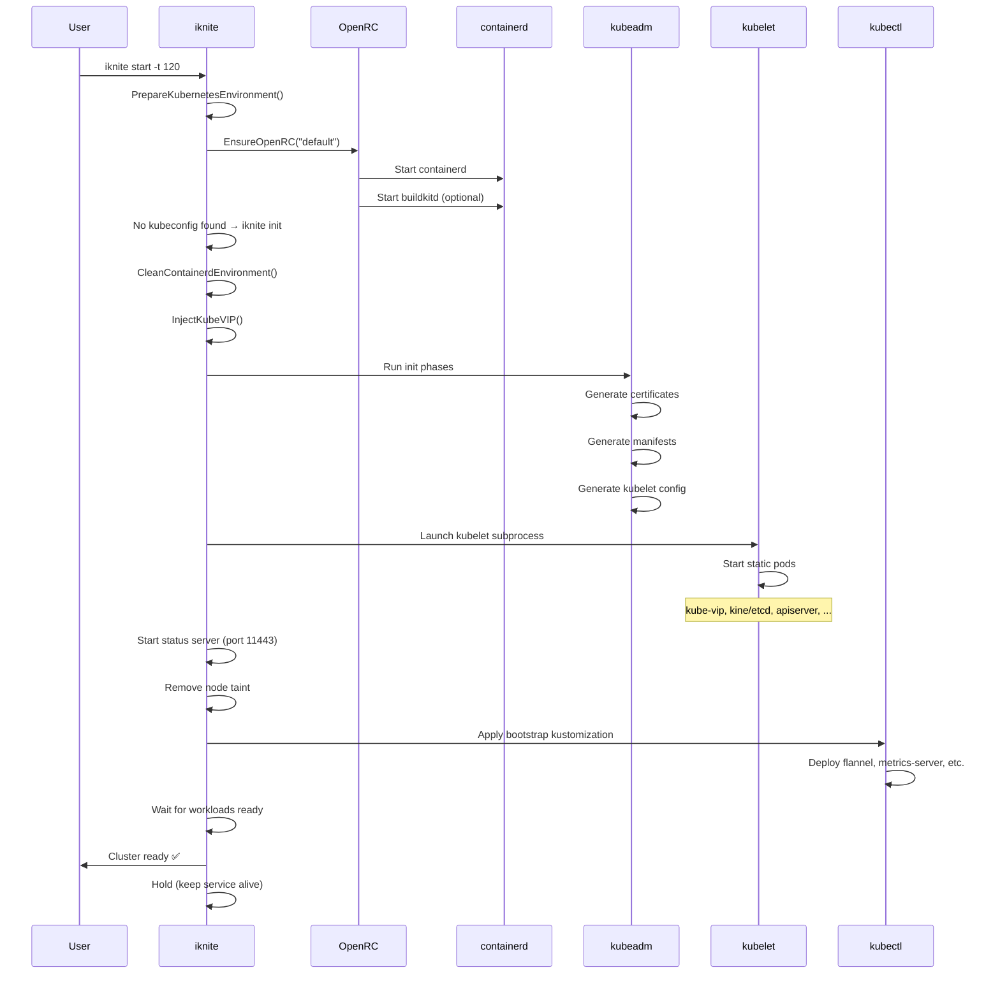

!!! wip "Work in progress"

    This documentation is in draft form and may change frequently.

# Cluster Initialization

This page describes the complete initialization sequence for an Iknite
cluster, from the first `iknite start` command to a fully running Kubernetes
cluster.

## Overview

Cluster initialization happens when `iknite start` is run and no existing
cluster configuration is found. The process involves:

1. Environment preparation
2. OpenRC startup
3. containerd verification
4. kubeadm init (modified)
5. Bootstrap kustomization
6. Workload settlement



## Phase 1: Environment Preparation

Before any Kubernetes initialization, Iknite prepares the Alpine Linux
environment:

```go
k8s.PrepareKubernetesEnvironment(ikniteConfig)
```

This includes:
- Setting up IP forwarding (`/proc/sys/net/ipv4/ip_forward = 1`)
- Setting up bridge network filter (`/proc/sys/net/bridge/bridge-nf-call-iptables = 1`)
- Creating `/etc/machine-id` if it doesn't exist
- Creating `/etc/crictl.yaml` for crictl to find containerd
- Patching `/etc/rc.conf` to prevent kubelet auto-start
- Adding a secondary IP address to the network interface (WSL2)
- Registering the domain name in `/etc/hosts`

## Phase 2: OpenRC Startup

```bash
alpine.EnsureOpenRC("default")
```

Ensures OpenRC is initialized and all services in the `default` runlevel are
started. This includes:
- `containerd`: Container runtime (required)
- `buildkitd`: BuildKit for image building (optional)

The `iknite` service itself runs in the `default` runlevel, making containerd
a dependency.

## Phase 3: containerd Environment Cleanup

Before starting kubeadm, Iknite cleans up any leftover state from a previous
unclean shutdown:

- Stops any running containers from previous cluster
- Unmounts leftover kubelet bind mounts
- Removes CNI network namespaces

This ensures a clean slate for kubeadm initialization.

## Phase 4: kubeadm Init Phases

Iknite runs the kubeadm init workflow with modifications:

### 4.1 Kube-VIP Injection

Before any kubeadm phases, Iknite writes the Kube-VIP static pod manifest to
`/etc/kubernetes/manifests/kube-vip.yaml`. This ensures Kube-VIP is started
as part of the control plane.

### 4.2 kubeadm Certificate Generation

Standard kubeadm phase: generates all PKI certificates in `/etc/kubernetes/pki/`.

### 4.3 kubeadm Manifest Generation

Standard kubeadm phase: generates control plane manifests in
`/etc/kubernetes/manifests/`:
- `kube-apiserver.yaml`
- `kube-controller-manager.yaml`
- `kube-scheduler.yaml`
- `kine.yaml` (or `etcd.yaml`)

### 4.4 kubelet Configuration

Standard kubeadm phase: generates kubelet configuration in `/var/lib/kubelet/`.

### 4.5 kubelet Launch (Modified)

Instead of starting kubelet via OpenRC, Iknite launches it as a subprocess:

```go
kubeletCmd := exec.Command("/usr/bin/kubelet",
    "--bootstrap-kubeconfig=/etc/kubernetes/bootstrap-kubelet.conf",
    "--config=/var/lib/kubelet/config.yaml",
    // ... other flags
)
kubeletCmd.Start()
```

kubelet then detects the static pod manifests and starts the control plane pods.

### 4.6 Status Server Start

Iknite starts its HTTPS status server on port `11443` before the cluster
finishes initializing, so external tools can monitor progress.

### 4.7 kubeadm Bootstrap Token

Standard kubeadm phase: creates the bootstrap token for kubelet certificate
rotation.

### 4.8 kubeconfig Generation

Standard kubeadm phase: generates kubeconfig files including `/root/.kube/config`.

### 4.9 Node Taint Removal

After the API server is ready, Iknite removes the control plane taint:

```bash
kubectl taint nodes --all node-role.kubernetes.io/control-plane-
```

### 4.10 CoreDNS Suppression

Iknite skips the kubeadm `addon/coredns` phase. CoreDNS is deployed via the
bootstrap kustomization instead.

## Phase 5: Bootstrap Kustomization

After the control plane is ready, Iknite applies the bootstrap kustomization:

```go
provision.ApplyKustomization("/etc/iknite.d")
```

The kustomization deploys:
- CoreDNS
- Flannel CNI
- Local Path Provisioner
- Kube-VIP Cloud Provider
- Metrics Server

After successful application, Iknite creates a marker ConfigMap to prevent
re-application on subsequent starts:

```bash
kubectl create configmap iknite-config -n kube-system
```

## Phase 6: Workload Settlement

Iknite polls the cluster until all managed workloads are ready:

```go
k8s.WaitForWorkloads(ctx, ikniteConfig, timeout)
```

Progress is reported:

```
INFO Workloads total: 7, ready: 0, unready: 7
INFO Workloads total: 7, ready: 3, unready: 4
INFO Workloads total: 7, ready: 6, unready: 1
INFO Workloads total: 7, ready: 7, unready: 0
```

## Phase 7: Service Hold

After all workloads are ready, the `iknite init` process **holds** (blocks)
to keep the OpenRC service alive. The process only exits when:
- OpenRC sends SIGTERM (graceful shutdown)
- The kubelet process exits unexpectedly

This design is essential for OpenRC service management, which expects the
service process to remain running.

## First Boot vs. Subsequent Starts

| Condition | Action |
|-----------|--------|
| No kubeconfig | Full initialization (all phases above) |
| Kubeconfig exists, same config | Start OpenRC only, poll until ready |
| Kubeconfig exists, config changed | `iknite reset` then full initialization |

The state check uses:

```go
apiConfig.IsConfigServerAddress(ikniteConfig.GetApiEndPoint())
```

## Initialization Progress

Monitor initialization progress with:

```bash
# Watch the status
watch iknite status

# Watch logs
tail -f /var/log/iknite.log

# Check the status file
cat /run/iknite/status.json | jq .status
```
