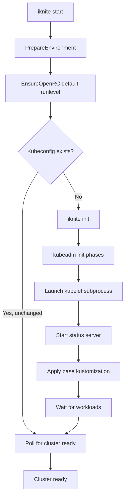

!!! wip "Work in progress"

    This documentation is in draft form and may change frequently.

# Architecture

This page describes the internal architecture of Iknite: how it wraps kubeadm,
manages the kubelet lifecycle, integrates with OpenRC, and keeps the cluster
clean across restarts.

## High-Level Overview



## Component Architecture

### The Iknite CLI

Iknite is a single Go binary built with [Cobra](https://github.com/spf13/cobra).
The main commands are:

| Command | Description |
|---------|-------------|
| `iknite start` | Start the cluster (OpenRC-based) |
| `iknite init` | Full kubeadm-based cluster initialization |
| `iknite reset` | Reset the cluster (calls kubeadm reset) |
| `iknite clean` | Clean containerd state without full reset |
| `iknite status` | Display environment, config and workload checks |
| `iknite info` | Print cluster configuration |
| `iknite info status` | Query the live status server |
| `iknite kustomize` | Manage bootstrap kustomizations |

### Package Structure

```
pkg/
├── alpine/       Alpine Linux utilities (OpenRC, IP, networking)
├── apis/         Kubernetes-style API types (IkniteCluster, IkniteClusterSpec)
├── cmd/          Cobra command implementations
├── config/       Configuration loading and merging (Viper)
├── constants/    Project-wide constants (paths, ports, defaults)
├── cri/          Container Runtime Interface utilities (containerd)
├── k8s/          Kubernetes interaction layer (checks, phases, workloads)
├── provision/    Bootstrap kustomization orchestration (embedded + /etc/iknite.d)
├── server/       Iknite status HTTPS server (mTLS)
├── testutils/    Mocking helpers for unit tests
└── utils/        General utilities (filesystem, executor)
```

## Kubeadm Wrapping

One of Iknite's key innovations is **deep kubeadm integration** through Go's
`//go:linkname` directive. Instead of shelling out to kubeadm, Iknite:

1. Imports kubeadm packages directly
2. Uses `//go:linkname` to access unexported kubeadm functions
3. Customizes individual **workflow phases**

This allows Iknite to modify specific kubeadm init phases without forking the
entire kubeadm codebase.

### Modified Init Phases

Iknite customizes the following kubeadm init phases:

- **Kube-VIP injection**: Inserts Kube-VIP as a static pod manifest before
  the control plane starts, so the virtual IP is available immediately
- **CoreDNS suppression**: Prevents kubeadm from deploying CoreDNS (it is
  deployed via the kustomization instead, allowing customization)
- **Kubelet launch**: Instead of starting kubelet via OpenRC, Iknite launches
  it as a supervised subprocess. This allows precise lifecycle control
- **Node taint removal**: The control plane taint is removed so workloads can
  be scheduled on the single node
- **IP assignment**: In WSL2, a stable secondary IP is added to `eth0`
- **mDNS registration**: `iknite.local` is registered via pion/mdns

### Reset Phases

The `iknite reset` command similarly wraps `kubeadm reset`, adding:

- Stopping the kubelet subprocess
- Cleaning up containerd namespaces
- Removing iknite-specific configuration

## Kubelet Lifecycle

Unlike standard kubeadm setups where kubelet is managed by systemd (or OpenRC),
Iknite manages kubelet as a **direct subprocess**:

```
iknite init
  └── exec.Command("kubelet", ...)
        └── kubelet process (PID tracked in initData.kubeletCmd)
```

This design:
- Prevents kubelet from auto-starting via OpenRC (patched via `/etc/rc.conf`)
- Lets Iknite cleanly stop kubelet on shutdown
- Enables iknite to detect kubelet crashes and respond accordingly

## OpenRC Integration

Iknite integrates with [OpenRC](https://wiki.alpinelinux.org/wiki/OpenRC),
Alpine's init system:

```
/etc/init.d/iknite      ← OpenRC service script
/etc/conf.d/iknite      ← Service configuration (IKNITE_ARGS)
/etc/runlevels/default/ ← iknite service enabled here
```

On `rc-service iknite start`, OpenRC runs `/sbin/iknite init`, which:

1. Starts containerd (dependency)
2. Runs kubeadm-based initialization (if first boot)
3. Applies the bootstrap kustomization
4. Waits for workloads to become ready
5. **Holds** (blocks) to keep the iknite service process alive while the
   cluster runs

On `rc-service iknite stop`, OpenRC sends SIGTERM to the iknite process, which:

1. Gracefully terminates kubelet
2. Shuts down the status server
3. Runs `iknite clean` to clean up containerd state

## State Machine

The cluster state is tracked in `/run/iknite/status.json`:

```json
{
  "apiVersion": "iknite.kaweezle.com/v1alpha1",
  "kind": "IkniteCluster",
  "spec": { ... },
  "status": {
    "state": "running",
    "currentPhase": "workloads",
    "lastUpdateTimeStamp": "...",
    "workloadsState": {
      "count": 7, "readyCount": 7, "unreadyCount": 0,
      "ready": [...], "unready": []
    }
  }
}
```

Possible states:

| State | Description |
|-------|-------------|
| `initializing` | kubeadm init in progress |
| `running` | Cluster fully running and workloads ready |
| `stopping` | Graceful shutdown in progress |
| `stopped` | Cluster stopped |
| `error` | Error during initialization or runtime |

## Status Server

Iknite runs a small HTTPS server on port `11443` providing live cluster status:

- **mTLS** using the Kubernetes CA (`/etc/kubernetes/pki/`)
  - Server certificate: `iknite-server.crt` / `iknite-server.key`
  - Client certificate: `iknite-client.crt` / `iknite-client.key`
- **Endpoints**:
  - `GET /status` – Returns current `IkniteCluster` JSON
  - `GET /healthz` – Returns `"ok"` for liveness checks
- The client kubeconfig at `/root/.kube/iknite.conf` (and
  `/etc/kubernetes/iknite.conf`) is used by `iknite info status`

## Bootstrap Kustomization

After the control plane is ready, Iknite applies a kustomization to install
networking and storage components:

```
/etc/iknite.d/          ← System kustomization directory (from APK)
  kustomization.yaml
  base/
    coredns.yaml
    kube-flannel.yaml
    kube-vip-addresspool.yaml
    kustomization.yaml
```

The kustomization is applied using the embedded kustomize library. After
successful application, a `ConfigMap` named `iknite-config` is created in the
`kube-system` namespace to mark the kustomization as applied and prevent
re-application on subsequent starts.

## IP Address Management (WSL2)

In WSL2 environments, the dynamic IP makes stable cluster configuration
impossible. Iknite handles this by:

1. Detecting WSL2 via environment or configuration
2. Adding a **virtual IP** (`192.168.99.2/24` by default) to `eth0`:
   ```
   ip addr add 192.168.99.2/24 dev eth0
   ```
3. Using this IP as the `advertise-address` for kubeadm
4. Registering the domain name via `/etc/hosts` and mDNS

On restart, the same IP is re-added, ensuring continuity without re-initialization.

## Configuration System

Iknite uses [Viper](https://github.com/spf13/viper) for configuration with the
following priority (highest to lowest):

1. CLI flags (e.g., `--domain-name`)
2. Environment variables (prefix `IKNITE_`, e.g., `IKNITE_DOMAIN_NAME`)
3. Config file (`/etc/iknite.d/iknite.yaml` or `~/.config/iknite/iknite.yaml`)
4. Defaults in code

Configuration is mapped to `IkniteClusterSpec`:

```go
type IkniteClusterSpec struct {
    KubernetesVersion           string
    DomainName                  string
    NetworkInterface            string
    ClusterName                 string
    Kustomization               string
    APIBackendDatabaseDirectory string
    Ip                          net.IP
    StatusServerPort            int
    CreateIp                    bool
    EnableMDNS                  bool
    UseEtcd                     bool
}
```
