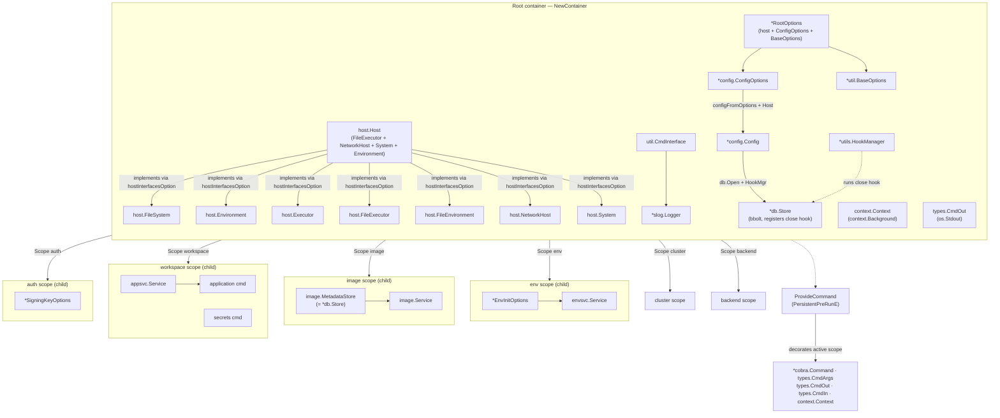

<!-- cSpell: words bbolt envsvc entrancy imagesvc appsvc hostInterfacesOption kustomize helmfile ArgoCD SOPS -->

# iknitectl

`iknitectl` is a collection of development tools for the iknite project. It
provides utilities for managing secrets, building artifacts, and other
development tasks that are not part of the main `iknite` binary.

The package is built around a [Cobra](https://github.com/spf13/cobra) command
tree wired together with a [uber-go/dig](https://github.com/uber-go/dig)
dependency-injection (DI) container. This document explains the command
structure and, in detail, the DI container created and configured in
[`di.go`](./di.go).

## Command structure

The root command is created by `CreateRootCmd` in [`root.go`](./root.go). It
registers the following subcommand trees, each scoped into its own `dig.Scope`
so that providers are isolated per branch:

| Command     | Aliases    | Created by           | Purpose                                |
| ----------- | ---------- | -------------------- | -------------------------------------- |
| `env`       | `e`        | `CreateEnvCmd`       | Manage the iknitectl local environment |
| `image`     | `i`, `img` | `CreateImageCmd`     | Manage provisioning images             |
| `cluster`   | `c`, `cl`  | `CreateClusterCmd`   | Manage iknite clusters                 |
| `workspace` | `w`, `ws`  | `CreateWorkspaceCmd` | Workspace-level operations             |
| `auth`      | `a`        | `CreateAuthCmd`      | Manage credentials and key material    |
| `backend`   | `b`, `bck` | `CreateBackendCmd`   | Manage backend definitions             |

Notable leaf commands:

- `env init` — initialize the iknitectl working directory (`env_init.go`, backed
  by `pkg/iknitectl/env`).
- `image info|list|inspect|pull|remove` — image metadata operations backed by
  `pkg/iknitectl/image` and persisted in a `bbolt` store (`pkg/iknitectl/db`).
- `workspace application` (aliases `app`, `a`) — validate/render ArgoCD
  applications; execution logic lives in `pkg/iknitectl/application` as a
  `Service` (`application.go` is a thin command).
- `workspace secrets` — SOPS-backed secrets management (`pkg/cmd/secrets`).
- `auth signing-key` — extract an APK signing key from a SOPS-encrypted secrets
  file (`install_signing_key.go`).

## Dependency injection container

The DI container is the backbone of the package. It is created by `NewContainer`
in [`di.go`](./di.go) and uses `uber-go/dig`. The design favors **constructor
injection**: commands declare their dependencies as function parameters and
resolve them via `scope.Invoke(...)` at run time. This keeps command code free
of global state and makes the package easy to test with in-memory fakes (see
[`di_test.go`](./di_test.go) and `pkg/testutil`).

The diagram below shows the object hierarchy grouped by scope. The root
container (`NewContainer`) owns the host, options, and shared services. Each
subcommand tree receives a child `dig.Scope` that inherits the root providers
and adds its own request-scoped objects. `ProvideCommand` injects the Cobra
command, args, I/O streams, and context into the active scope at run time.



### Container construction

`NewContainer(opts *RootOptions)` returns a `*dig.Container`. It always calls
`provideOptionsAndHostFromOpts`, which handles both cases:

- **`opts == nil`** → provides a default `*RootOptions` via
  `NewRootOptions(nil)` (which falls back to the OS-backed
  `host.NewDefaultHost`). This is the production path used by `Execute`.
- **`opts != nil`** → provides the caller-supplied `*RootOptions` directly. This
  is the path used by tests and by callers that need to inject a fake
  host/filesystem (e.g. `testutil.NewDummyHost`).

In both cases the concrete `opts.host` is registered under `host.Host` and, via
the package-level `hostInterfacesOption` (`dig.As(...)`) slice, under every host
capability interface (`FileSystem`, `Environment`, `Executor`, `FileExecutor`,
`FileEnvironment`, `NetworkHost`, `System`). This single shared slice removes
the previous duplication between two provider paths and the redundant plain
`host.Host` provider.

`NewContainer` also provides request-scoped defaults up front —
`context.Background` for `context.Context` and `os.Stdout` for `types.CmdOut` —
so handlers can resolve them directly; `ProvideCommand` then decorates these
with the live command's context and output (see below).

After the host and options are in place, `NewContainer` registers the shared
application dependencies:

| Provider                        | Provides                | Notes                                              |
| ------------------------------- | ----------------------- | -------------------------------------------------- |
| `utils.NewHookManager`          | `*utils.HookManager`    | Runs cleanup hooks in `PersistentPostRunE`         |
| `func(opts *RootOptions)`       | `*config.ConfigOptions` | Exposes the embedded `ConfigOptions`               |
| `configFromOptions`             | `*config.Config`        | Resolves paths from `ConfigOptions` + host         |
| `newStore`                      | `*db.Store`             | Opens the `bbolt` database; registers a close hook |
| `func(opts *RootOptions)`       | `*util.BaseOptions`     | Exposes the embedded `BaseOptions`                 |
| `util.NewCmdInterface`          | `util.CmdInterface`     | Logger + viper holder                              |
| `func(cmdIf util.CmdInterface)` | `*slog.Logger`          | Logger derived from the `CmdInterface`             |

### Host abstraction

The host is the central abstraction. `pkg/host` defines a set of small
interfaces that compose into `host.Host`:

- `FileSystem` — file operations
- `Environment` — environment/user directories
- `Executor` — command execution
- `FileExecutor` — `FileSystem` + `Executor`
- `FileEnvironment` — `FileSystem` + `Environment`
- `NetworkHost` — network interface management
- `System` — system-level operations (unmount, etc.)
- `Host` — `FileExecutor` + `NetworkHost` + `System` + `Environment`

`NewContainer` registers the concrete host implementation under **all** of these
interfaces (via `dig.As` in the default path, or a single `Provide` with
`dig.As` in the options path). This lets any command request exactly the
capability it needs (e.g. `host.FileSystem`) without depending on the full
`Host`, improving testability and decoupling.

### Per-command providers

Command constructors receive a `*dig.Scope` (a child of the root container) and
register their own request-scoped providers there. Examples:

- `CreateImageCmd` provides `image.MetadataStore` (the `*db.Store`) and
  `image.NewService`.
- `CreateEnvInitCmd` provides `*EnvInitOptions` and `envsvc.NewService`.
- `CreateSigningKeyCmd` provides `*SigningKeyOptions`, optionally decorating it
  with the resolved `host.FileSystem`.

`ProvideCommand` (in `di.go`) is invoked from `PersistentPreRunE` to inject the
Cobra command itself and its runtime context into the container:

- `*cobra.Command` and `types.CmdArgs` (the command-line args) are provided.
- `types.CmdOut` is **decorated** from `command.OutOrStdout()` (overriding the
  `os.Stdout` default provided in `NewContainer`).
- `types.CmdIn` is provided from `command.InOrStdin()`.
- `context.Context` is **decorated** from `command.Context()` (overriding the
  `context.Background` default provided in `NewContainer`).

Because the command/context types are inherently request-scoped,
`ProvideCommand` uses `Decorate` rather than re-`Provide` for `CmdOut` and
`context.Context`, which avoids the previous duplicate-provider error and the
brittle `"already provided"` string matching. This is why handlers can simply
declare `out types.CmdOut` or `command *cobra.Command` as parameters and have
them injected.

### Lifecycle hooks

`PersistentPreRunE` (in `root.go`) calls `ProvideCommand`, then invokes the
container to:

1. Bind flags to viper, set up logging, and initialize configuration via
   `util.InitializeConfiguration`.
2. Resolve the final `*config.Config` against the host.

`PersistentPostRunE` invokes the `*utils.HookManager`, which runs any registered
cleanup hooks — notably the `db.Store.Close()` hook registered by `newStore`.
This guarantees the `bbolt` database is closed even on error paths.

### Helper API

`di.go` exposes two small generic helpers used throughout the package and tests:

- `Resolve[T any](s Injector) (T, error)` — resolves a value of type `T` from a
  container or scope.
- `ProvideCommand(c Provider, cmd *cobra.Command, args []string) error` —
  injects the command, args, I/O streams, and context into a `Provider`
  (container or scope), using `Decorate` when a type is already present.

The `Injector` and `Provider` interfaces are minimal abstractions over
`dig.Container`/`dig.Scope` so that the same helpers work on either.

## Testing

Tests construct the container with a fake host. The common pattern (see
`createMemFSContainer` in `di_test.go`):

```go
fs := host.NewMemMapFS()
h, _ := testutil.NewDummyHost(fs, &testutil.DummyHostOptions{})
options := iknitectl.NewRootOptions(h)
c, _ := iknitectl.NewContainer(options)
```

Because the host is injected, commands run entirely against an in-memory
filesystem and a `bytes.Buffer` output, with no real OS side effects. The
`DelegateHost`/`DummyHost` machinery in `pkg/testutil` implements all host
interfaces, and `di_test.go` additionally demonstrates `c.Decorate(...)` to
augment the logger after the fact.

## Possible improvements

The following are non-breaking refinements identified while analyzing the
command tree and the DI wiring. They target duplication, hidden side effects,
and consistency with the existing service pattern.

### Command structure

- **Clarify placeholder commands.** `cluster` and `backend` register empty
  command trees (their constructors take `_ *dig.Scope`). Either implement
  subcommands or document them as stubs to signal intent.
- **Document the `workspace` subtree.** `application` and `secrets` are nested
  under `workspace`, but the command table only lists top-level commands. Add a
  sub-table (or tree) describing `workspace application` (`validate`/`render`/
  `render-all`) and `workspace secrets` so the full surface is visible.
- **Reconcile `install`/`kustomize` constructors.** `CreateInstallCmd` and
  `CreateKustomizeCmd` exist but are not wired into `CreateRootCmd`. Either
  register them (and decide how `kustomize` coexists with
  `workspace application`) or delete the dead constructors to avoid confusion.
- **Deduplicate `signing-key`.** `auth signing-key` and `install signing-key`
  both call `CreateSigningKeyCmd(s, nil)`. Extract a shared builder so the two
  trees stay in sync.

### DI container

- **Make `newStore`'s side effect explicit.** `newStore` registers a
  `db.Store.Close()` hook on the `*utils.HookManager` as a hidden side effect of
  construction. Document this clearly or move hook registration to
  `PersistentPreRunE` so the provider stays free of side effects.
- **Avoid providing process globals in `NewContainer`.** `context.Background`
  and `os.Stdout` are provided as defaults for `context.Context` and
  `types.CmdOut`, then overridden by `ProvideCommand` via `Decorate`. This
  works, but injecting `os.Stdout` as a default is unusual; consider providing
  only the command-derived values (or `io.Discard` for tests) to keep the
  default container side-effect free.
- **Expose the host interface list as a documented contract.** The
  `hostInterfacesOption` slice is the single source of truth for which host
  capabilities are injectable. Add a short comment (or a test) asserting that
  every `host.*` interface used by commands is present in that slice, so a newly
  added capability cannot silently fail to resolve.

### Testing

- **Unify the two container builders.** `pkg/testutil.TestContainer` builds its
  own `dig.Container` (with `DelegateHost`/`DummyHost`), while iknitectl tests
  use `NewContainer(options)` with a fake host. Both achieve the same goal.
  Route `testutil.TestContainer` through `iknitectl.NewContainer` (or expose a
  `NewContainer` variant accepting a host) to keep a single source of truth for
  wiring.
- **Add a `Service` constructor test for `application`.** The `application`
  package has thorough logic tests but no direct assertion that `NewService`
  wires `FS`/`Logger`. A small `TestNewService` (mirroring `image`/`env`) would
  lock the constructor contract.
